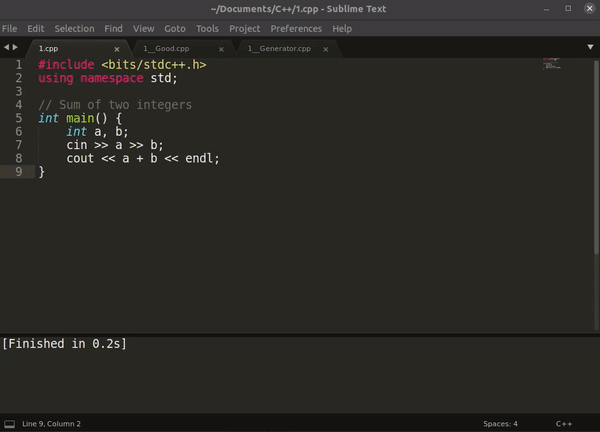

# Stress Tester

## Intro



This project contains the files that can be used for Stress Testing the C++ solution, i.e., to find a test case in which the main solution fails.

This tester is divided into three types, for testing three different category of problems:
* Normal tester: To compare the main solution with a correct brute-force solution.
* Custom tester: To validate a solution with more than one correct output.
* Interactive tester: To test the interactive problems.

**Note**:
* To directly execute the script from the terminal, add the file `stress-test.sh` to the PATH variable, or move it to `/usr/bin/` directory, by executing the following command from the root of this directory:
  ```bash
  sudo cp stress-test.sh /usr/bin/
  ```
* To directly run the stress-tester from an IDE (e.g. Sublime Text), add the command to execute this script to the build file of the IDE. For Sublime Text, the following lines shall be added to the build file:
  ```json
  {
      "variants":
      [
          {
              "name": "Stress Tester",
              "shell": false,
              "cmd": ["bash", "-c", "gnome-terminal -- bash -c 'stress-test.sh \"${file}\" normal 500 2; read'"]
          },
          {
              "name": "Custom Tester",
              "shell": false,
              "cmd": ["bash", "-c", "gnome-terminal -- bash -c 'stress-test.sh \"${file}\" custom 500 2; read'"]
          },
          {
              "name": "Interactive Tester",
              "shell": false,
              "cmd": ["bash", "-c", "gnome-terminal -- bash -c 'stress-test.sh \"${file}\" interactive 500 2; read'"]
          },
      ]
  }
  ```
## Usage

   ```
   ./stress-test.sh <file.cpp> ...[optional_parameters]...
   
   All the cpp files should be present in the same directory

   Optional Parameters:
   
       These parameters must follow the order given:

       <testing_type>      Must be either 'normal', 'custom' or 'interactive'.
                            normal: Testing the normal problems
                            custom: Testing the solutions which require custom tester
                            interactive: Testing the interactive problems
                           [DEFAULT]: normal

       <no_of_testcases>   Total number of testcases to check.
                           [DEFAULT]: 500

       <timeout>           Timeout of each execution (given in seconds)
                           [DEFAULT]: 2 (2 seconds)
   ```
Examples:
* `./stress-test.sh main.cpp`
* `./stress-test.sh main.cpp custom 50`
* `./stress-test.sh main.cpp interactive 100 1`
 
Make sure that the file `stress.sh` is executable. If it isn't, then run `sudo chmod +x stress-test.sh` to make it executable.

## Description

*The description is messed up, feel free to contribute and improve it :)*

For all the below examples, the main solution has the filename: `main.cpp`.
The extra files required for testing are named as `'main file' + '__' + '[type].cpp'`, as described below. Note that __ denotes **two** underscores.  

**Usage:** `./stress-test.sh main.cpp ...[optional parameters]...`


### Normal testing

The following files are required:

<details>
<summary><code>main.cpp</code></summary>

  - The main solution which the user wants to validate.

</details>

<details>
<summary><code>main__Good.cpp</code></summary>

  - The correct, brute force solution, for comparing the final output.

</details>

<details>
<summary><code>main__Generator.cpp</code></summary>

  - The file to generate random test cases.
  - Output the test case to the standard output stream (`stdout`) using `cout`.

</details>


### Custom testing

The following files are required:

<details>
<summary><code>main.cpp</code></summary>

  - The main solution which the user wants to validate.

</details>

<details>
<summary><code>main__Checker.cpp</code></summary>

  - The checker to validate a solution with more than one correct output.
  - Take input from the standard input stream (`stdin`) using `cin` in the following order:
    1. The first input is the testcase produced by the generator: `main__Generator.cpp`.
    2. The second input is the answer produced by the main solution file: `main.cpp`.
  - Give verdict, such as `Expected [...] found [...]` to the standard error stream (`stderr`) using `cerr`.
  - Finally, `return 0` in case of SUCCESS, or `return 1` in case of FAILURE.

</details>

<details>
<summary><code>main__Generator.cpp</code></summary>

  - The file to generate random test cases.
  - Output the test case to the standard output stream using `cout`.

</details>


### Interactive testing

The following files are required:

<details>
<summary><code>main.cpp</code></summary>

  - The main solution which the user wants to validate.

</details>

<details>
<summary><code>main__Generator.cpp</code></summary>

  - This file acts as a generator as well as an interactor (to generate random test case and to interact with the main solution).
  - Use `cin` and `cout` for interaction (`cin` - take user's query, `cout` - give back response). For printing anything to the console, or for giving verdict, use `cerr`.
  - First, generate a random test case - e.g. the number to guess, and store it in some container.
  - Then loop until the number of queries exceed the allowed query, or the user guesses the correct answer.
  - Now, inside the loop, first take the output produced by the main solution from the standard input stream using `cin`.
  - Then, give back the response to the standard output stream using `cout`.
  - After every interaction, check:
    1. Whether the number of questions asked is within limits.
    2. Whether the response of the user is correct or not.
  - In case of any error, output it using `cerr` and simultaneously `return 1`.
  - In case the answer is correct, give appropriate verdict using `cerr` and `return 0`.

For debugging purposes,
  - Output every user's query to the standard error stream using `cerr`, (i.e., for every `cin`, also output the values to `cerr`).
  - Print the correct answer at the end using `cerr` before returning 0 or 1.

</details>

In case of interactor, make sure to flush the output by using `endl`, and not `\n`.


## Files

<details>
<summary><code>main.cpp</code></summary>

```cpp
#include <bits/stdc++.h>
using namespace std;

int main() {
    int n;
    cin >> n;
    int answer;
    // Write the main solution here
    cout << answer << endl;
}
```

</details>

<details>
<summary><code>main__Good.cpp</code></summary>

```cpp
#include <bits/stdc++.h>
using namespace std;

int main() {
    int n;
    cin >> n;
    int answer;
    // Write the brute-force correct solution here
    cout << answer << endl;
}
```

</details>

<details>
<summary><code>main__Generator.cpp</code></summary>

```cpp
#include <bits/stdc++.h>
using namespace std;

mt19937 rng(chrono::steady_clock::now().time_since_epoch().count());
int rand(int l, int r){
    uniform_int_distribution<int> uid(l, r);
    return uid(rng);
}

int main() {
    // Generate random test case
    int testcase = rand(1, 100);
    
    // Output the random test case
    cout << testcase << endl;
}
```

Getting the current testcase in the Generator (to generate fixed test cases, if required):

```cpp
#include <bits/stdc++.h>
using namespace std;

// Add the argc and argv in the main function to accept the arguments
int main(int argc, char **argv){
    // The testcase is passed as the first argument to the generator (argv[1])
    // Testcases starts from 0 upto (TOTAL_TESTCASE - 1)
    
    // Convert the argument to an integer
    int test = atoi(argv[1]);
    
    // Generate a fixed testcase according to the testcase number
    cout << test << " " << test * 2 << endl;
}
```

</details>

<details>
<summary><code>main__Checker.cpp</code></summary>

```cpp
#include <bits/stdc++.h>
using namespace std;

int main() {
    // Take the testcase as input
    int testcase;
    cin >> testcase;
    
    // Take the answer produced by main solution as input
    int answer;
    cin >> answer;
    
    // Check whether the answer produced satisfies the test case
    int expected_answer;
    bool is_correct = false;
    // ...
    if (is_correct) {
        // Output the verdict to stderr
        cerr << endl;
        cerr << "Expected " << expected_answer << ", found " << answer << endl;
        return 1;     // return 1 in case of FAILURE
    }
    return 0;     // return 0 in case of SUCCESS
}
```

</details>

<details>
<summary><code>main__Interactor.cpp</code></summary>

```cpp
#include <bits/stdc++.h>
using namespace std;

mt19937 rng(chrono::steady_clock::now().time_since_epoch().count());
int rand(int l, int r){
    uniform_int_distribution<int> uid(l, r);
    return uid(rng);
}

// ALWAYS USE `endl` FOR FLUSHING THE OUTPUT, NOT `\n`

int main() {
    // Generate random test case
    int answer = rand(1,100);
    
    int asked_questions = 0;
    while (true) {
        char user_response_type;
        int response;
        
        // Take the user's response as input
        cin >> user_response_type >> response;
        // Outputting this to stderr for debugging purposes
        cerr << user_response_type << " " << response << endl;
        
        asked_questions++;
        if (asked_questions > 100) {
            cerr << "Too many questions" << endl;     // Outputting every verdict to stderr
            return 1;     // return 1 in case of FAILURE
        }
        
        if (user_response_type == '?') {
            // Give proper response to stdout
            // FOR INTERACTING WITH USER, GIVE THE RESPONSE USING `cout`, FOR GIVING VERDICT, USE `cerr`
            int interactor_response;
            // ...
            cout << interactor_response << endl;
            cerr << interactor_response << endl;     // Outputting this to stderr for debugging purposes
        } else if (user_response_type == '!') {
            if (response == answer) {
                cerr << "Correct solution" << endl;
                break;
            } else {
                cerr << "Incorrect solution." << endl;
                return 1;     // return 1 in case of FAILURE
            }
        }
    }
    // Output the correct answer and return 0 (SUCCESS)
    cerr << "Correct Answer: " << answer << endl;
    return 0;
}
```

</details>

  - `sample/`: Folder contains some sample interactors.
